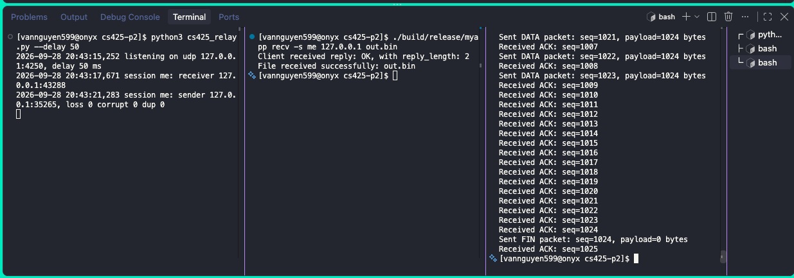

# Project 2: Reliable Data Transfer

- Name: Van Nguyen
- Email: vannguyen599@u.boisestate.edu
- Class: CS525

## Known Bugs or Issues

There are no issues that I have known of. Payload has been sent successfully with correct arguments

You can find in `test.txt` are some of the commands that had been used to test.
No crash and memory leaks have been found with test coverage for `lab.h`, `utils.h` is 100%.

## Experience

This project was personally challenging and took a lot of time, especially when debugging and designing the code for testability. I used AI to help clarify the requirements, but I also had to read documentation carefully and as I did not have a lot of experience with coding server/client in C. Keeping the Go-Back-N logic independent from I/O was another important design challenge. I have learnt a lot about design state machine when doing this kind of project as most of the info and guidance that I got was by reading the diagram that they had in the book. I also spent hours debugging a segmentation fault that turned out to be caused by an off-by-one error in the header size. Testing is one of the part that I used AI quite a bit as I have it built some testing harness for me so that I can reuse them throughout the tests.

## Design

The protocol is divided conceptually into three layers:

1. **Packets:** `compute_checksum()` and `parse_incoming_packet()` validate and
   decode packet bytes. Packet encoding builds the header, payload, and checksum
   that are sent over the wire.
2. **Go-Back-N state machines:** The sender tracks its `base`, `next` sequence,
   window, and retransmission deadline. `populate_transmission_window()`,
   `handle_valid_ack()`, and `handle_retransmission_timeout()` implement sending,
   cumulative ACK progress, and retransmission. The receiver tracks its expected
   sequence and FIN linger state in `consume()`. Time values are passed into the
   sender's transition helpers rather than read from a clock there.
3. **I/O:** `publish()` and the receiver's `process()` coordinate the socket,
   relay registration, polling, clock, and files. They turn network events and
   timer expirations into state-machine calls, then send packets or write received
   data as required.

My project only partially enforces this separation: packet parsing and
sender state helpers are separate, but `send_packet()` performs a socket send,
`consume()` sends ACKs and writes to a file, and `publish()`/`process()` combine
I/O loops with protocol transitions. That's the reason why you can see a lot of mocking that I did
inside of the `server.c`, `client.c`, and `utils.c` so I can avoid the I/O blocking call. 

## Results

| Window | Loss | Corrupt | Dup | Average time (s) | Throughput (KiB/s) |
| ------ | ---- | ------- | --- | ---------------- | ------------------ |
| 1      | 0    | 0       | 0   | 104.90           | 9.76               |
| 16     | 0    | 0       | 0   | 6.714            | 152.52             |
| 1      | 0.05 | 0       | 0   | 129.70           | 7.90               |
| 16     | 0.05 | 0       | 0   | 23.822           | 42.99              |

Throughput is calculated as file size divided by average transfer time. Since
the transferred file is 1 MiB (1024 KiB), throughput in KiB/s is `1024 / time`.

1.  **From the window 1, no loss run, compute the round trip time your sender actually saw. (It sent 1025 packets and waited one round trip for each.) The relay adds 100 ms. Where does the rest come from?**

        The observed round trip time was `104.90 s / 1025 = 0.10234 s` per packet. This is about `2.34 ms` more than the relay's 100 ms
    delay, due to sender and receiver processing, relay scheduling, and timing
    overhead.

2.  **Use that round trip time to explain the speedup at window 16. Is it close to 16 times? Why or why not?**

        The window-16 run was `104.90 / 6.714 = 15.62` times faster, close to the

    16-packet window's speedup.This allows the sender to have up to 16
    packets in flight instead of waiting for an ACK after each packet. The small
    difference from 16 comes from startup and final-packet handling, plus processing
    and scheduling overhead that the larger window cannot eliminate.

3.  **Why does 5% loss cost the window 16 run more than it costs the window 1 run? Think about what a timeout makes the sender resend in each case.**

        With Go-Back-N, a timeout resends all unacknowledged packets. At window 16, one

    lost packet can therefore cause as many as 16 packets to be sent again,
    including packets the receiver may already have received. At window 1, only one
    packet is outstanding, so a timeout wastes less work, though stop-and-wait still
    has high baseline latency. The relative slowdown is about 255% at window 16
    versus 24% at window 1. In absolute time, the measured increases are 17.11 s
    and 24.80 s respectively, so the window-16 loss penalty is larger
    proportionally, not in added seconds for these measurements.
